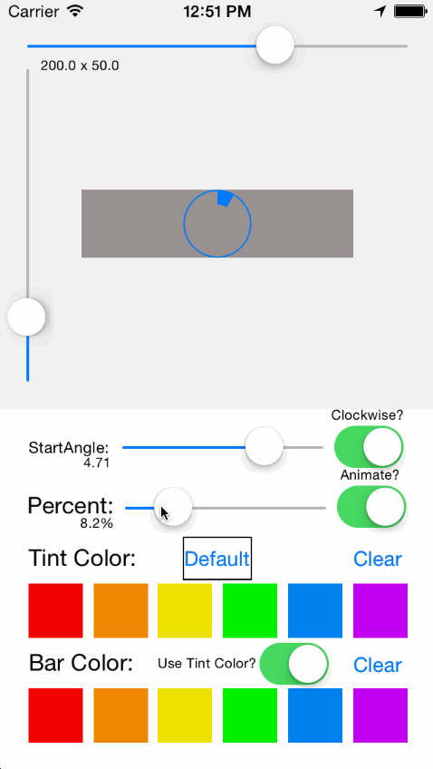

GRKCircularGraphView
===========
A UIView subclass which renders a one-item circular bar graph with an animatable
percentage property and configurable orientation, colors, etc. CALayers are used for
drawing efficiency and implicit animation.

  

### Installing

If you're using [CocoPods](http://cocopods.org) it's as simple as adding this to your
`Podfile`:

	pod 'GRKCircularGraphView'

otherwise, simply add the contents of the `GRKCircularGraphView` subdirectory to your
project.

### Documentation

`GRKCircularGraphView` is to be used as you would any other UIView and will draw the
circular bar graph to fill the smallest dimension of its bounds.

The main API is documented in `GRKCircularGraphView.h` but at its most basic:

	GRKCircularGraphView *graphView = ...
	graphView.percent = 0.42f;

The color of the graph and border is determined by the `tintColor` of the view, but can be
explicitly configured, and it is capable of different colors for the bar and border.

Additional documentation is available in `GRKCircularGraphView.h` and example usage
can be found in the `GRKCircularGraphViewTestApp` source.

#### Disclaimer and Licence

* This work is licensed under the [Creative Commons Attribution 3.0 Unported License](http://creativecommons.org/licenses/by/3.0/).
  Please see the included LICENSE.txt for complete details.

#### About

A professional iOS engineer by day, my name is Levi Brown. Authoring a blog
[grokin.gs](http://grokin.gs), I am reachable via:

Twitter [@levigroker](https://twitter.com/levigroker)  
Email [levigroker@gmail.com](mailto:levigroker@gmail.com)  

Your constructive comments and feedback are always welcome.
